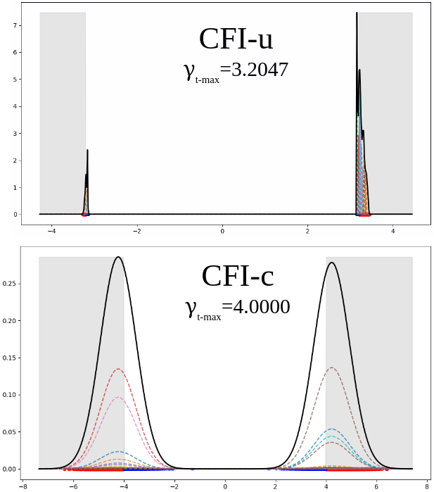
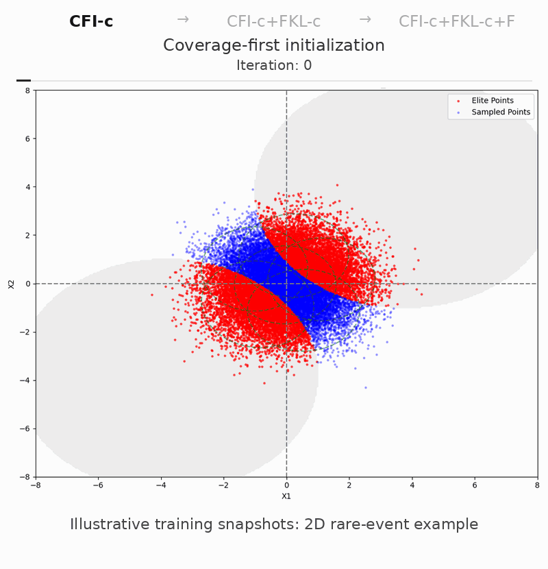
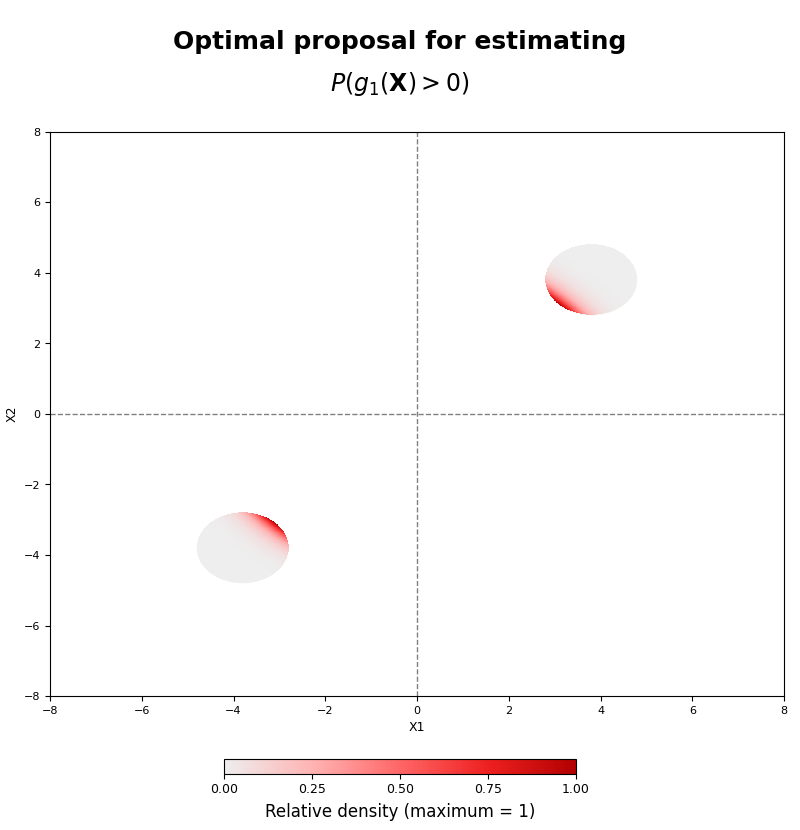

# Robust Importance Sampling for Rare Events via Constrained Gaussian Mixtures

Paweł Lorek · Rafał Nowak · Rafał Topolnicki · Tomasz Trzciński · Maciej Zięba

**NeurIPS 2026** · [Paper](https://arxiv.org/abs/2610.07485) · [Quickstart](#cpu-quickstart) · [docs/results.md](docs/results.md) · [Reproduce](docs/reproducibility.md)

## TL;DR

We estimate rare-event probabilities by first **finding the rare-event region**
with coverage-first initialization (CFI), then **refining a Gaussian-mixture
proposal** with *constrained KL optimization*. Covariance constraints ensure
finite importance-sampling variance for qualifying final GMM proposals;
optional flow refinement can further improve empirical efficiency.

### A simple rare event, a large difference: an illustrative 1D example

For a standard Gaussian variable $X\sim\mathcal{N}(0,1)$, we estimate
$P(\lvert X\rvert>4)\approx6.33425\times10^{-5}$ using a 20-component GMM.

#### Why coverage and constraints?

<table>
<tr>
<td width="48%" valign="top">
<p><strong>1. Find.</strong> CFI moves the proposal toward the rare-event region through progressively harder intermediate levels.</p>
<p><strong>2. Refine.</strong> Forward- or reverse-KL fitting improves sampling efficiency while retaining covariance constraints.</p>
<p><strong>3. Optional flow.</strong> A normalizing flow further adapts the proposal to the event geometry.</p>
<p>On the right, unconstrained CFI collapses before reaching the target event. Constrained CFI reaches both tails.</p>
<p><strong>CFI-u:</strong> unconstrained GMM, with no finite-variance guarantee.</p>
<p><strong>CFI-c:</strong> covariance-constrained GMM, with finite IS variance when the proposal satisfies the theorem's strict covariance condition.</p>
</td>
<td width="52%" align="center">

<br><sub>Top: CFI-u. Bottom: CFI-c. Gray: the target event |X| &gt; 4.</sub>
</td>
</tr>
</table>

Selected results from Table 1 of the paper:

| Method | Estimate | Variance reduction ↑ | CoV ↓ |
|---|---:|---:|---:|
| Crude Monte Carlo (CMC) | 6.55e-05 | 1 | 4.06e-01 |
| fFKL-c (adaptive CE) | 6.36e-05 | 3.67e+03 | 6.65e-03 |
| CFI-u | 0 | — | — |
| CFI-c | 6.34e-05 | 2.94e+03 | 7.44e-03 |
| CFI-c+FKL-c | 6.33e-05 | 5.56e+03 | 5.42e-03 |
| CFI-c+FKL-c+F | 6.34e-05 | **5.81e+03** | **5.29e-03** |

Here, CFI-u misses the event. Constrained CFI followed by forward-KL refinement
reduces variance by over 5,000 times relative to CMC; the flow adds a smaller
improvement. A dash denotes an unavailable metric, not zero.
See [docs/results.md](docs/results.md) for the full toy comparison, metric definitions,
and higher-dimensional benchmarks.

### A 2D example: from coverage to efficient sampling

The animation illustrates estimation of $P(g_1(\mathbf{X})>0)$ for a Gaussian
input: a two-dimensional example with two separated circular rare-event regions.
CFI first locates both regions, constrained forward-KL fitting refines the
mixture, and a flow then reshapes the proposal.

<p align="center">
  
  
</p>

**Reading the animation:** gray marks the current level set
$g_1(\mathbf{x})>\gamma_t$; during CFI this intermediate threshold moves toward
the target $\gamma=0$. Red points meet the current threshold; blue points do
not. Green dashed ellipses show GMM component contours. The active stage is
black. We show selected snapshots from a historical training run, omitting
intermediate iterations; playback speed does not represent computation time.

The finite-variance theorem covers qualifying final constrained GMMs, not the
optional flow proposal. Finite variance alone does not ensure accurate or
stable estimates at a fixed budget.

See [docs/results.md](docs/results.md) for more benchmarks, numerical comparisons, and
empirical failure counts.

## Installation

Python 3.11 or 3.12 is supported. With [`uv`](https://docs.astral.sh/uv/):

```bash
git clone https://github.com/lorek/robust-cfi-is.git
cd robust-cfi-is
uv sync --extra dev
```

The ResNet-based g7 workflow is optional:

```bash
uv sync --extra dev --extra g7
```

## CPU quickstart

From the repository root:

```bash
uv run python examples/quickstart_g1.py
```

The equivalent CLI command is:

```bash
uv run robust-cfi-is run configs/examples/g1_cfi_c.yaml
```

Both commands fit a six-component constrained GMM on the analytic two-
dimensional `g1` benchmark, construct and certify the proposal, and run
ordinary unnormalized importance sampling. Tracking and network access are
disabled. A compact JSON record is written below `runs/`.

Configuration can be checked without running the method:

```bash
uv run robust-cfi-is validate configs/examples/g1_cfi_c.yaml
```

## Supported methods

`robust-cfi-is` provides a Python API and command-line interface. The package
constructs and checks the final GMM against the strict covariance condition
in the paper; the covariance parameterization alone is not the check.

The public method registry supports:

- analytic g1, g2, g3, g5, g6, and g10 benchmark definitions;
- constrained and unconstrained CFI (`cfi_c`, `cfi_u`);
- standalone forward-KL fits (`ffkl_c`, `ffkl_u`);
- standalone reverse-KL fits (`frkl_c`, `frkl_u`);
- constrained CFI followed by forward- or reverse-KL refinement;
- the two corresponding RealNVP refinements (`cfi_c_frkl_c_flow` and
  `cfi_c_ffkl_c_flow`);
- defensive reverse KL (`frkl_d`) on the full nominal/GMM mixture;
- CPU execution;
- constrained and unconstrained full-covariance GMMs;
- certified final-GMM construction; and
- ordinary unnormalized importance sampling.

See [`docs/naming.md`](docs/naming.md) for the mathematical public names.
The flow subset and its theorem boundary are described in
[`docs/flows.md`](docs/flows.md).

Portable paper-facing configs for the supported analytic benchmarks are under
`configs/paper/`. See [`docs/reproducibility.md`](docs/reproducibility.md) for
validation, dry-run planning, verified local artifact evaluation, expected
results, and the current reproduction tiers.

The g7 workflow is offline-only and requires explicit `--g7-data`,
`--resnet-weights`, and `--event-device cpu|cuda:N` arguments. It never
downloads data or weights and never falls back to a local cache. See
[`docs/g7.md`](docs/g7.md). The required prepared tensor and model weights are
external user-supplied inputs, are verified by exact byte size and SHA-256,
and are not redistributed, bundled, or hosted by this repository. The earlier
tensor-preparation script has status `DOES_NOT_EXACTLY_REPRODUCE`.

The 90 certified proposals use the canonical JSON envelope and are
stored directly in the repository under
`reproducibility/q_final/` and indexed by
`reproducibility/artifacts.json`. Manifest-relative lookup is the offline
default; each file's size and SHA-256 are checked before loading, and an
explicit alternative local path remains supported. No external artifact
mirror or download step is required. Artifact metadata uses neutral logical
identifiers and records the tensor identities and certification checks used by
the loader.

The q_final files are intentionally excluded from the Python wheel and sdist.
Use a Git checkout or VCS source archive for artifact-assisted paper
evaluation. See [`docs/artifacts.md`](docs/artifacts.md).

The finite-variance safeguard applies to a qualifying constrained GMM used as
the certified proposal. A subsequent `+F` transformation yields a flow-family
proposal that is explicitly **not** marked theorem-certified; its observed
robustness is empirical. The supported method set is the registry listed
above.

## Citation

If you use this work, please cite the paper. Machine-readable metadata is in
[`CITATION.cff`](CITATION.cff).

```bibtex
@inproceedings{lorek2026robust,
  author = {Paweł Lorek and Rafał Nowak and Rafał Topolnicki and Tomasz Trzciński and Maciej Zięba},
  title = {Robust Importance Sampling for Rare Events via Constrained Gaussian Mixtures},
  booktitle = {40th Conference on Neural Information Processing Systems (NeurIPS 2026)},
  year = {2026},
  url = {https://arxiv.org/abs/2610.07485}
}
```

## License and external materials

The project source, project documentation (including the paper-derived README
Figure 1 above), and the 90 certified proposals stored as `q_final` JSON
artifacts are covered by the same MIT grant; see [`LICENSE`](LICENSE). The five joint
rightsholders are Paweł Lorek, Rafał Nowak, Rafał Topolnicki, Tomasz Trzciński,
and Maciej Zięba. The prepared g7 tensor, ResNet-18 pretrained weights,
ImageNetV2 image bytes, and third-party dependency code or assets are excluded
from this project license. They are not redistributed, bundled, or hosted by
this repository. See
[`docs/third-party-assets.md`](docs/third-party-assets.md) for the exact
external-input boundary.
